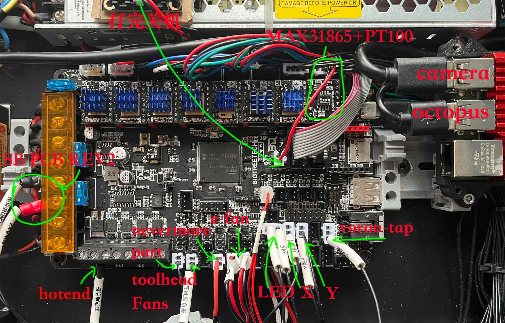
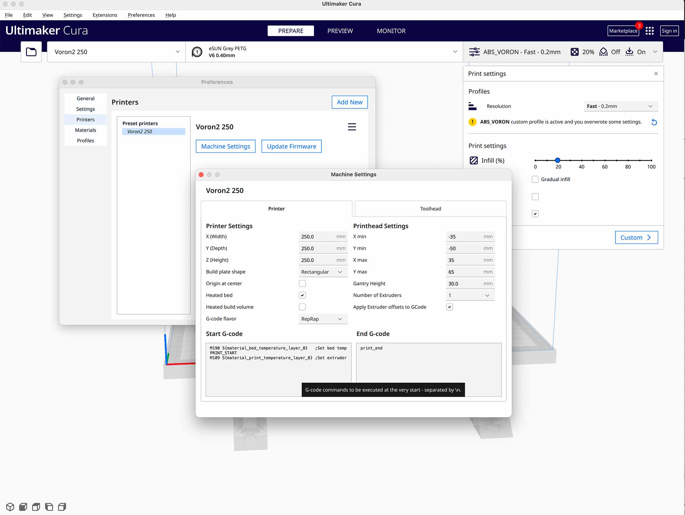

#Voron 2.4 调试手册 2023	
`疯狂豆Luke`

--------

# Voron-Tap
[klipper-gcode](https://www.klipper3d.org/G-Codes.html)  | [Voron-Tap-config](https://github.com/VoronDesign/Voron-Tap/blob/main/config/tap_klipper_instructions.md)


1. 修改 Z endstop:
   * stepper_z 
    endstop_pin: probe:z_virtual_endstop
   * SAVE_CONFIG
    [stepper_z] position_endstop  删除这行

2. 修改 homing_override
  G0 X125 Y125  F3600
  G28 Z
  
3. 修改  probe
  x_offset: 0
  y_offset: 0
  z_offset: 0

4. 增加 activate_gcode
```
activate_gcode:
    
    
    
    

    
        { action_respond_info('Extruder temperature target of %.1fC is too high, lowering to %.1fC' % (TARGET_TEMP, PROBE_TEMP)) }
        M109 S{ PROBE_TEMP }
    
        # Temperature target is already low enough, but nozzle may still be too hot.
        
            { action_respond_info('Extruder temperature %.1fC is still too high, waiting until below %.1fC' % (ACTUAL_TEMP, MAX_TEMP)) }
            TEMPERATURE_WAIT SENSOR=extruder MAXIMUM={ MAX_TEMP }
        
    
    
```
5. 校准 传感器
   1. 温度设置 150度
   2. 执行归位 Home
   3. 执行 PROBE_CALIBRATE
   4. 热床放 1 张 A4 纸
   5. 调整 A4 纸阻力
   6. Accept
   7. SAVE_CONFIG 
   
--------
# 摄像头 WebCamera
### 配置摄像头
1. 摄像头插入树莓派 USB
2. 修改 webcam.txt 
```
camera="auto"
camera_usb_options="-r 1280x720 -f 10" 
```
3. 保存重启
4. Setting 选项卡 cameras
  * ADD CAMERA
  * 启用 Enable
  * 设置 Name
  * 选择 MJPEG Adaptive 


### 延时摄影
[Moonraker-timelapse](https://github.com/mainsail-crew/moonraker-timelapse)
1. 安装组件

 ```
 ## 上传源文件夹到 树莓派
 scp -r moonraker-timelapse pi@192.168.51.51:/home/pi/moonraker-timelapse
 默认密码 raspberry

 ## 在树莓派上安装
 ssh pi@192.168.51.51
 cd ~/moonraker-timelapse
 make install
```
2.  配置组件

```
## 配置版本更新检测
 # moonraker.conf

[update_manager timelapse]
type: git_repo
primary_branch: main
path: ~/moonraker-timelapse
origin: https://github.com/mainsail-crew/moonraker-timelapse.git
managed_services: klipper moonraker


## 配置视频文件路径（保存）
# moonraker.conf

[timelapse]
##   Following basic configuration is default to most images and don't need
##   to be changed in most scenarios. Only uncomment and change it if your
##   Image differ from standart installations. In most common scenarios 
##   a User only need [timelapse] in their configuration.
#output_path: ~/timelapse/
##   Directory where the generated video will be saved
#frame_path: /tmp/timelapse/
##   Directory where the temporary frames are saved
#ffmpeg_binary_path: /usr/bin/ffmpeg
##   Directory where ffmpeg is installed


## 添加头文件配置（保存）
# printer.cfg

[include timelapse.cfg]


 ## 重启树莓派
 sudo reboot 
```


3. 启用组件
  setting 中 Timelapse 选择 Camera


------
# Voron-Tap With Cura 
此项可选配置，请按自己实际情况配置

Cura 切片软件 Start_Gcode 调整
M190 S{material_bed_temperature_layer_0}   ;设置热床温度
PRINT_START                                ;调用PRINT_START 指令
M109 S{material_print_temperature_layer_0} ;设置打印头温度


------
## Others

1. `klipper_config_20231126`` 目录为202311月26日备份设置
2. 主板配置
my_octpus_cable_pins:

3. cura_settings 适配 voron-tap

